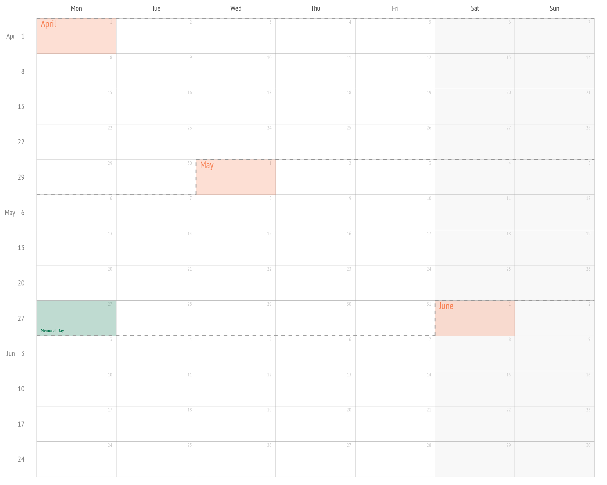
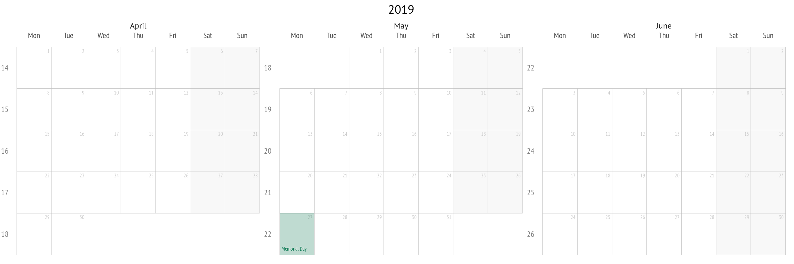
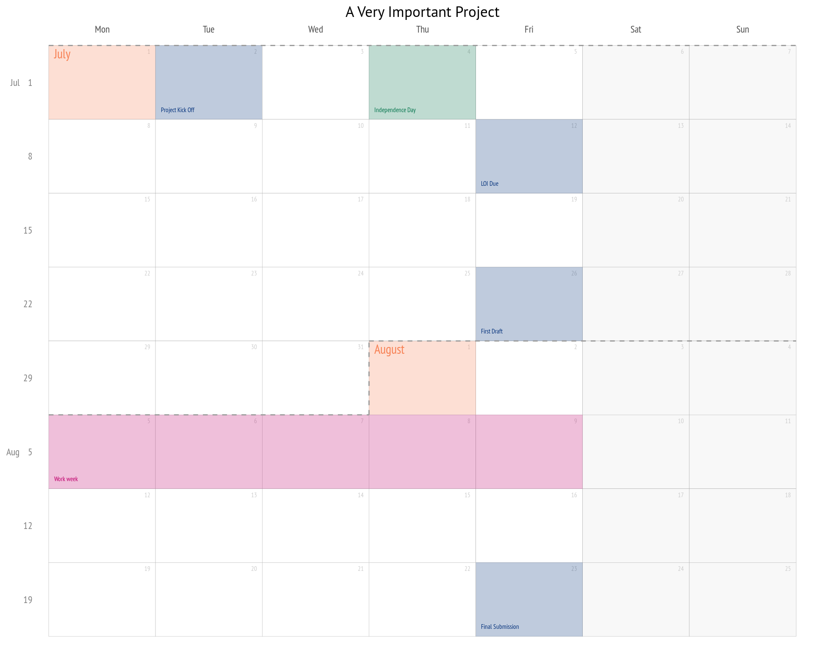

<!-- README.md is generated from README.Rmd. Please edit that file -->

# ggweekly

<!-- badges: start -->

<!-- badges: end -->

The goal of ggweekly is to easily create custom weekly planners with
[ggplot2](https://ggplot2.tidyverse.org).

## Installation

You can install **ggweekly** from GitHub with `devtools`

``` r
devtools::install_github("gadenbuie/ggweekly")
```

## Example

This is a basic example which shows you how to create a weekly planner
covering April, May, and June of 2019.

``` r
library(ggweekly)
ggweek_planner(
  start_day = "2019-04-01", 
  end_day = "2019-06-30", 
  show_day_numbers = TRUE, 
  show_month_boundaries = TRUE
)
```



You can also create traditional calendars as well.

``` r
ggweek_planner(
  start_day = "2019-04-01", 
  end_day = "2019-06-30", 
  show_day_numbers = TRUE, 
  show_month_boundaries = FALSE, 
  week_start_label = "isoweek"
) + 
  ggplot2::ggtitle("2019") +
  ggplot2::facet_wrap(~ month, scales = 'free')
```



## Project Planning

Create a tibble of days to highlight and pass into `highlight_days`.

``` r
project_days <- dplyr::tribble(
         ~ day,       ~ label,   ~ color,    ~ fill,
  "2019-07-02", "Project Kick Off", "#02307a", "#02307a",
  "2019-07-12", "LOI Due", "#02307a", "#02307a",
  "2019-07-26", "First Draft", "#02307a", "#02307a",
  "2019-08-05", "Work week", "#bf006c", "#bf006c",
  "2019-08-06", "", NA, "#bf006c",
  "2019-08-07", "", NA, "#bf006c",
  "2019-08-08", "", NA, "#bf006c",
  "2019-08-09", "", NA, "#bf006c",
  "2019-08-23", "Final Submission", "#02307a", "#02307a",
)

ggweek_planner(
  start_day = "2019-07-01",
  highlight_days = project_days
) +
  ggplot2::ggtitle("A Very Important Project")
```



## Printable Calendars

Here’s a printable calendar of 8 week time periods for 2019 and 2020:

  - [2019-weekly-planner.pdf](printable/2019-weekly-planner.pdf)
  - [2020-weekly-planner.pdf](printable/2020-weekly-planner.pdf)

The code chunk below shows how this PDF was created and can be adjusted
as needed. I included margins to the left and below the calendar for
extra notes.

``` r
start_date <- lubridate::floor_date(lubridate::ymd("2019-01-01"), "week", week_start = 1)
end_date <- lubridate::ceiling_date(lubridate::ymd("2019-12-31"), "week", week_start = 1) - 
  lubridate::days(1)
week_dates <- seq(start_date, end_date, by = "56 day")

showtext::showtext_auto()
sysfonts::font_add_google("PT Sans")
sysfonts::font_add_google("PT Sans Narrow")

pdf(here::here("printable", "2019-weekly-planner.pdf"), width = 8.5, height = 11)
for (idx_week in seq_along(week_dates)) {
  gcal <- ggweek_planner(start_day = week_dates[idx_week]) +
    ggplot2::theme(plot.margin = ggplot2::margin(1, 2, 3, 0.5, "in")) +
    ggplot2::ggtitle(paste(
      strftime(week_dates[idx_week], "%B %e, %Y"),
      strftime(week_dates[idx_week] + 55, "%B %e, %Y"),
      sep = " — "
    ))
  print(gcal)
}
dev.off()
#> quartz_off_screen 
#>                 2
```

    #> quartz_off_screen 
    #>                 2

And here are fullpage yearly calendars for 2019 and 2020.

  - [2019-full-year.pdf](printable/2019-full-year.pdf)
  - [2020-full-year.pdf](printable/2020-full-year.pdf)

<!-- end list -->

``` r
g2019 <- ggweek_planner(
  start_day = "2019-01-01", 
  end_day = "2019-12-31", 
  show_day_numbers = TRUE, 
  show_month_boundaries = FALSE, 
  show_month_start_day = FALSE,
  week_start_label = "isoweek"
) + 
  ggplot2::ggtitle("2019") +
  ggplot2::facet_wrap(~ month, scales = 'free')

ggplot2::ggsave(
  file = here::here("printable", "2019-full-year.pdf"),
  plot = g2019,
  width = 11, height = 8.5
)
```

-----

Please note that the ‘ggweekly’ project is released with a [Contributor
Code of Conduct](CODE_OF_CONDUCT.md). By contributing to this project,
you agree to abide by its terms.
